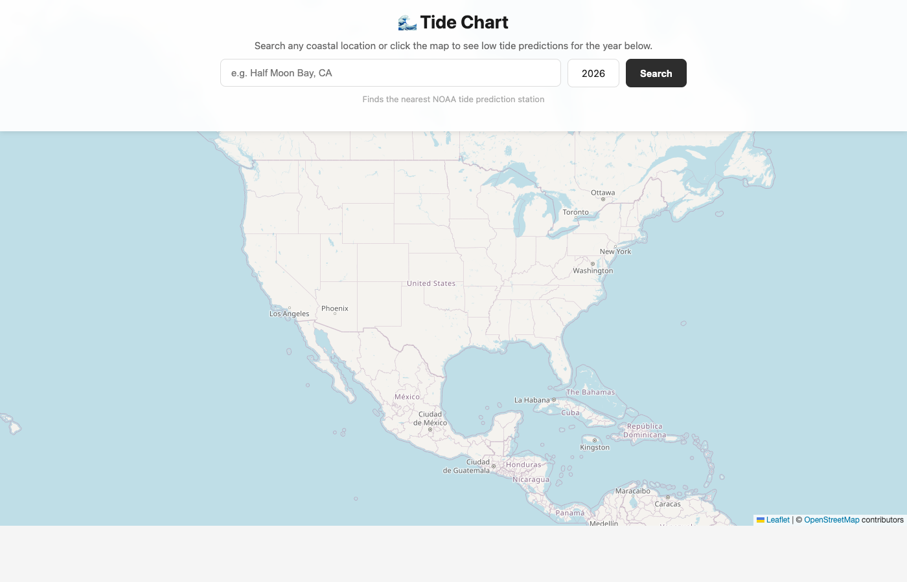
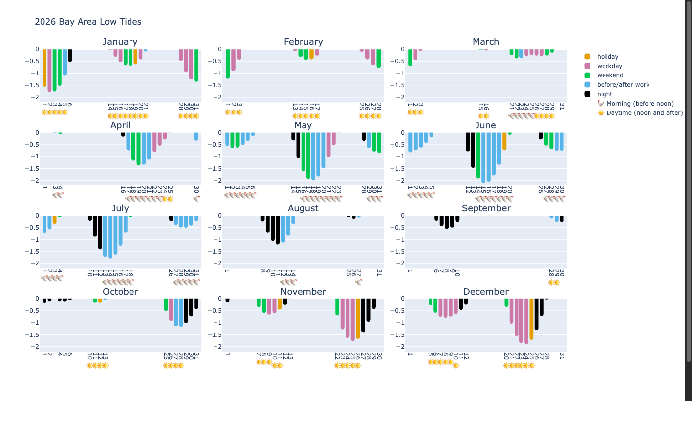

# 🌊 TideCharts

> Interactive low-tide prediction charts for coastal locations across the US


---

## What It Does

Tidepool fetches official tide prediction data from [NOAA](https://tidesandcurrents.noaa.gov/) and generates a year-at-a-glance interactive chart showing every qualifying low tide — color-coded by how accessible that day is for beach activities.

**Color legend:**

| Color | Label | Meaning |
|---|---|---|
| 🟢 Green | Weekend | Saturday or Sunday |
| 🔵 Blue | Before/after work | Weekday outside 10am–5pm |
| 🟠 Orange | Holiday | US federal holiday |
| 🟣 Purple | Workday | Weekday during work hours |
| ⚫ Black | Night | Outside ±1.5 hrs of sunrise/sunset |

---

## Features

- 🗺️ **Interactive map** — click any point on the map to auto-fill the search bar via reverse geocoding
- 🔍 **Location search** with autocomplete powered by [Nominatim](https://nominatim.openstreetmap.org/)
- 📡 **Auto station finder** — finds the nearest NOAA tide prediction station via haversine distance
- 🚫 **Distance guard** — blocks chart generation if the nearest station is >100 miles away
- 📅 **Year selector** — pick any year from 2000–2100
- 🌙 **Moon phase** — hover over any bar to see moon illumination %
- 🌅 **Sunrise/sunset** — hover info includes exact times for the day
- 📊 **Dual-tide days** — when two qualifying tides occur on the same day, both are shown as side-by-side offset bars
- 💾 **Download cache** — NOAA data is cached locally so repeat lookups are instant

---

## Screenshots

### Search UI


### Tide Chart (Half Moon Bay, 2026)


---

## Demo

> **Web UI** (`server.py`) — search any coastal US location:

```
python3 server.py
```
Then open [http://localhost:8080](http://localhost:8080)

> **Direct script** (`main.py`) — generate charts for hardcoded stations:

```
python3 main.py
```

---

## Installation

```bash
git clone https://github.com/gnodipac886/tidepool.git
cd tidepool
pip install -r requirements.txt
python3 server.py
```

---

## How It Works

```
User types "Half Moon Bay, CA"
    │
    ▼
Nominatim geocoding → (lat, lon)
    │
    ▼
NOAA Stations API → nearest station by haversine distance
    │
    ├─ > 100 miles away? → ❌ Error shown to user
    │
    ▼
NOAA tide data download (cached to tides_{year}_{station}.txt)
    │
    ▼
Parse & filter: keep only tides ≤ threshold (default 0.0 ft)
    │
    ▼
Enrich each tide with:
  • Sunrise / sunset times  (suntime + pytz)
  • Moon illumination %     (ephem)
  • Day label               (holidays + weekday logic)
    │
    ▼
Plotly bar chart → tideplot_{year}_{station}.html
    │
    ▼
Served inline via Flask iframe
```

---

## Project Structure

```
tidepool/
├── main.py          # Data pipeline and chart generation
├── server.py        # Flask web server and search UI
├── requirements.txt # Python dependencies
└── tidepool.ipynb   # Original exploration notebook
```

---

## Requirements

| Package | Purpose |
|---|---|
| `plotly` | Interactive bar chart generation |
| `pandas` | Data manipulation |
| `flask` | Local web server |
| `geopy` | Nominatim geocoding |
| `ephem` | Moon phase calculation |
| `suntime` | Sunrise/sunset times |
| `pytz` | Timezone handling |
| `holidays` | US federal holiday detection |

---

## Data Source

Tide predictions are fetched from the **NOAA Tides and Currents API**:
```
https://tidesandcurrents.noaa.gov/cgi-bin/predictiondownload.cgi
```
Data is in **MLLW datum**, **LST/LDT timezone**, standard (feet) units.

---

## License

MIT
